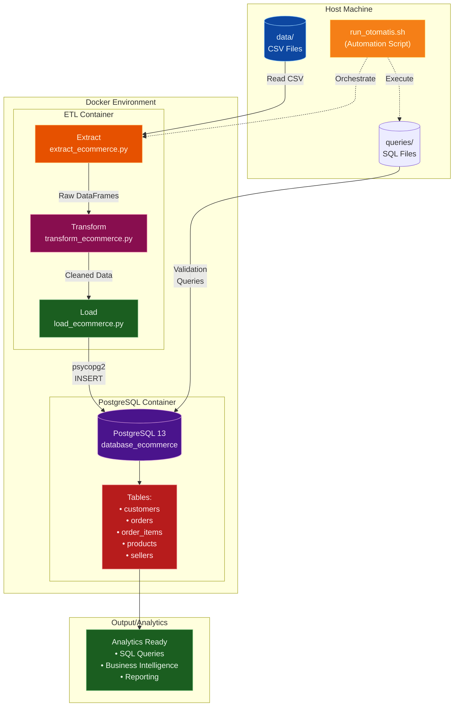
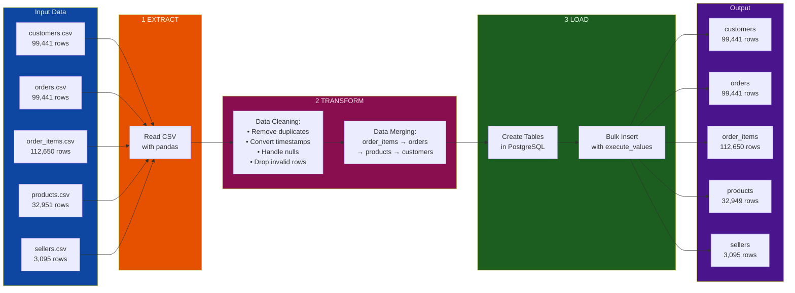
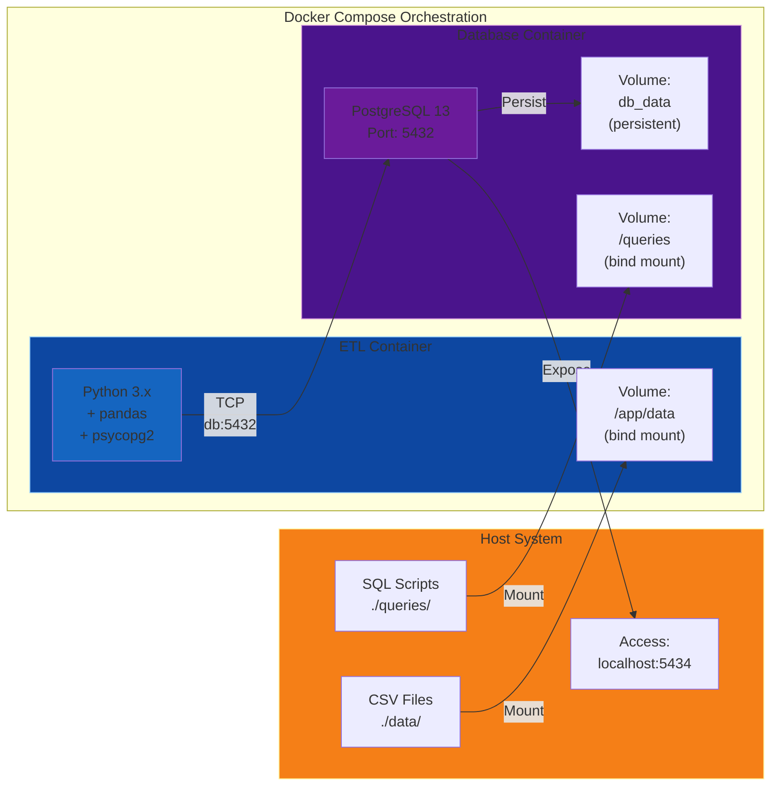
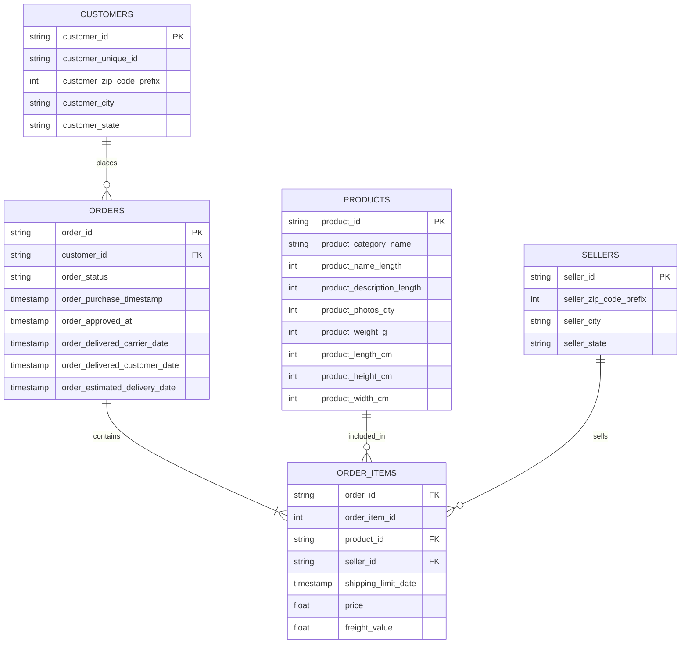

#  E-Commerce ETL Pipeline dengan Docker & PostgreSQL

Project ini merupakan **end-to-end ETL (Extract, Transform, Load) pipeline** untuk data e-commerce menggunakan **Python**, **Docker**, dan **PostgreSQL**. Pipeline ini mengolah data transaksi e-commerce dari [Brazilian E-Commerce Public Dataset by Olist](https://www.kaggle.com/datasets/olistbr/brazilian-ecommerce) untuk analisis bisnis.

##  Dataset Overview

Dataset yang digunakan berisi transaksi e-commerce di Brazil (2016-2018) dengan 5 tabel utama:

| Tabel | Jumlah Baris | Deskripsi |
|-------|-------------|-----------|
| `customers` | 99,441 | Data pelanggan (lokasi, ID unik) |
| `orders` | 99,441 | Data pesanan dengan status dan timestamp |
| `order_items` | 112,650 | Detail item per order (harga, produk, penjual) |
| `products` | 32,951 | Data produk dan kategori |
| `sellers` | 3,095 | Data penjual dan lokasi |

##  Arsitektur & Teknologi


## Detailed Architecture Diagram

### System Architecture



### ETL Data Flow



### Docker Container Communication



### Database Relationship Schema




### Tech Stack
- **Python 3.x** - ETL scripting
- **Pandas** - Data transformation
- **PostgreSQL 13** - Database warehouse
- **Docker & Docker Compose** - Containerization
- **psycopg2** - PostgreSQL connector

##  Struktur Project

```
p1_E-Commerce/
├── data/                           # Dataset CSV (raw data)
│   ├── olist_customers_dataset.csv
│   ├── olist_orders_dataset.csv
│   ├── olist_order_items_dataset.csv
│   ├── olist_products_dataset.csv
│   └── olist_sellers_dataset.csv
├── etl/                            # ETL scripts
│   ├── extract_ecommerce.py        # Extract: Membaca CSV
│   ├── transform_ecommerce.py      # Transform: Cleaning & merging
│   ├── load_ecommerce.py           # Load: Insert ke PostgreSQL
│   ├── dockerfile                  # Docker image untuk ETL
│   └── requirements.txt            # Python dependencies
├── queries/
│   └── queries.sql                 # SQL queries untuk validasi
├── docker-compose.yaml             # Orchestration config
└── run_otomatis.sh                 # Automated run script
```

##  ETL Flow

### 1️ **Extract**
- Membaca 5 file CSV dari folder `data/`
- Validasi struktur data dan tipe data
- Menampilkan info dataset (shape, null values, data types)

### 2️ **Transform**
**Cleaning per tabel:**
-  **Customers**: Remove duplicates
-  **Orders**: Remove duplicates + convert timestamps to datetime
-  **Order Items**: Remove duplicates + validate price/freight
-  **Products**: Remove duplicates + drop rows with null physical attributes
-  **Sellers**: Remove duplicates

**Merging:**
```
order_items (anchor)
  ↓ JOIN orders (on: order_id)
  ↓ JOIN products (on: product_id)
  ↓ JOIN customers (on: customer_id)
  = Fact Table (112,650 rows × 26 columns)
```

### 3️ **Load**
- Membuat koneksi ke PostgreSQL di Docker
- Create tables dengan schema yang sesuai
- Insert data cleaned ke PostgreSQL
- Validasi dengan sample queries

##  Cara Menjalankan

### Prasyarat
```bash
# Install Docker dan Docker Compose
docker --version
docker-compose --version
```

### Option 1: Automated Run (Recommended)
```bash
# Jalankan seluruh pipeline otomatis
bash run_otomatis.sh
```

Script ini akan:
1. Build Docker images
2. Start PostgreSQL container
3. Jalankan ETL pipeline
4. Validasi data dengan queries
5. Show sample results

### Option 2: Manual Step-by-Step
```bash
# 1. Build images
docker compose build

# 2. Start database container
docker compose up -d db

# 3. Tunggu database ready (check health)
docker compose ps

# 4. Jalankan ETL
docker compose run --rm etl python load_ecommerce.py

# 5. Validasi hasil
docker compose exec -it db psql -U ecommerce -d database_ecommerce -c '\dt'
```

##  Validasi & Testing

### Cek Tabel yang Terload
```bash
docker compose exec -it db psql -U ecommerce -d database_ecommerce -c '\dt'
```

Expected output:
```
 Schema |    Name     | Type  |   Owner   
--------+-------------+-------+-----------
 public | customers   | table | ecommerce
 public | order_items | table | ecommerce
 public | orders      | table | ecommerce
 public | products    | table | ecommerce
 public | sellers     | table | ecommerce
```

### Sample Query
```bash
# Lihat 10 customers pertama
docker compose exec -it db psql -U ecommerce -d database_ecommerce \
  -c 'SELECT * FROM customers LIMIT 10;'

# Jalankan custom queries
docker compose exec -T db psql -U ecommerce -d database_ecommerce \
  -f /queries/queries.sql
```

##  Database Schema

### Customers
```sql
customer_id (PK), customer_unique_id, customer_zip_code_prefix, 
customer_city, customer_state
```

### Orders
```sql
order_id (PK), customer_id (FK), order_status, 
order_purchase_timestamp, order_approved_at, 
order_delivered_carrier_date, order_delivered_customer_date,
order_estimated_delivery_date
```

### Order Items
```sql
order_id (FK), order_item_id, product_id (FK), seller_id (FK),
shipping_limit_date, price, freight_value
```

### Products
```sql
product_id (PK), product_category_name, product_name_length,
product_description_length, product_photos_qty, product_weight_g,
product_length_cm, product_height_cm, product_width_cm
```

### Sellers
```sql
seller_id (PK), seller_zip_code_prefix, seller_city, seller_state
```

##  Use Cases & Analytics

Data hasil ETL dapat digunakan untuk:
-  **Monthly Sales Trend** - Analisis revenue per bulan
-  **Top Products by Revenue** - Produk terlaris berdasarkan kategori
-  **Geographic Analysis** - Distribusi pelanggan dan penjual per region
-  **Delivery Performance** - Analisis ketepatan waktu pengiriman
-  **Customer Segmentation** - Segmentasi based on purchase behavior

## Configuration

### Environment Variables
Database connection di-configure via environment variables di `docker-compose.yaml`:
```yaml
DB_HOST: db
DB_USER: ecommerce
DB_PASSWORD: securepassword
DB_NAME: database_ecommerce
DB_PORT: 5432 (internal) → 5434 (host)
```

### Local Connection (dari host)
```bash
psql -h localhost -p 5434 -U ecommerce -d database_ecommerce
# Password: securepassword
```

## Cleanup

```bash
# Stop containers
docker compose down

# Stop + hapus volumes (reset database)
docker compose down -v
```


**Author**: Hendra  
**Project Type**: Data Engineering Portfolio  
**Tech**: Python | PostgreSQL | Docker | pandas
